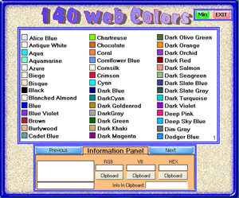

## Web Colors \(140\) Updated

### Description

Choose colors for your web site. I've got all the colors loaded now plus added a few things.Added:a second project with 216 colors,plus corrected a few bugs in first project.
 
### More Info
 

             |
---                |---
**Submitted On**   |2008-11-17 06:58:24
**By**             |[Kenneth Foster](https://github.com/Planet-Source-Code/PSCIndex/blob/master/ByAuthor/kenneth-foster.md)
**Level**          |Intermediate
**User Rating**    |5.0 (20 globes from 4 users)
**Compatibility**  |VB 6\.0
**Category**       |[Graphics](https://github.com/Planet-Source-Code/PSCIndex/blob/master/ByCategory/graphics__1-46.md)
**World**          |[Visual Basic](https://github.com/Planet-Source-Code/PSCIndex/blob/master/ByWorld/visual-basic.md)
**Archive File**   |[Web\_Colors21344211172008\.zip](https://github.com/Planet-Source-Code/kenneth-foster-web-colors-140-updated__1-71376/archive/master.zip)

